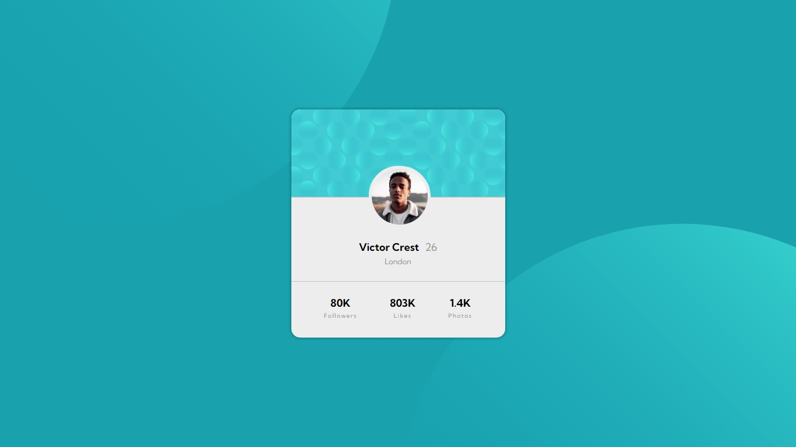

# Frontend Mentor - Profile card component solution

This is a solution to the [Profile card component challenge on Frontend Mentor](https://www.frontendmentor.io/challenges/profile-card-component-cfArpWshJ). Frontend Mentor challenges help you improve your coding skills by building realistic projects. 

## Table of contents

- [Overview](#overview)
  - [The challenge](#the-challenge)
  - [Screenshot](#screenshot)
  - [Links](#links)
  - [Built with](#built-with)
  - [What I learned](#what-i-learned)
  - [Continued development](#continued-development)
  - [Useful resources](#useful-resources)
- [Author](#author)


## Overview

A profile card component project built using Sass and implementing the BEM methodology.

### The challenge

- Build out the project to match the design provided by Frontend Mentor.

### Screenshot




### Links

- Live site: [GitHub Pages](https://dbrwd.github.io/profile-card-component-sass/)

### Built with

- Sass
- BEM
- Flexbox

### What I learned

This is my first project using Sass and the BEM methodology so it really helped me to better understand this tools.

Also I had never heard of the overflow property before (really useful), nor this way of using the background-position property.

```css
.properties {
  overflow-y: hidden;
  background-position: right 50vw bottom 50vh, left 50vw top 50vh;
}
```

### Continued development

In future projects I would like to focus on improving my responsive design skills, and start using a mobile-first approach.


## Author

- My Github - [dbrwd](https://github.com/dbrwd)
- Frontend Mentor - [@dbrwd](https://www.frontendmentor.io/profile/dbrwd)
- LinkedIn - [@rubendebrun](https://www.linkedin.com/in/rubendebrun/)